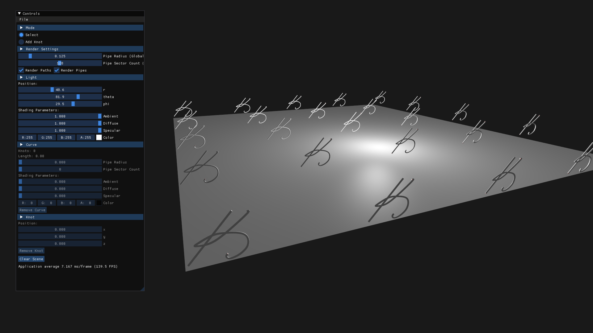
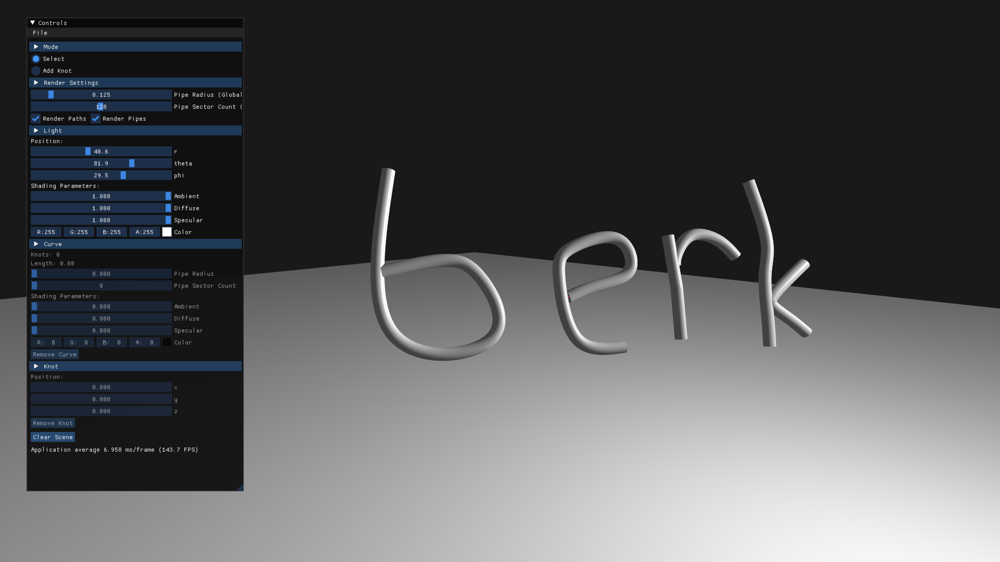
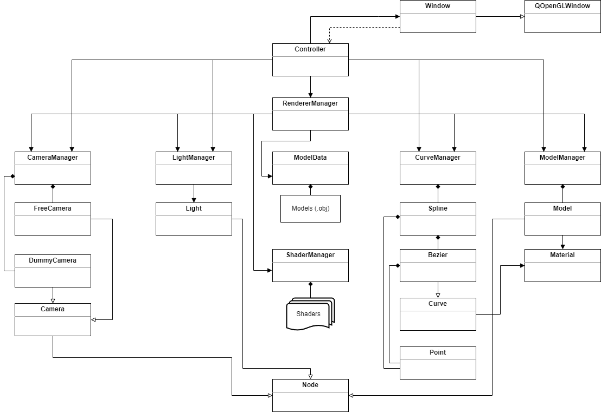

# BSplineCurves3D
Rendering 3D B-splines using OpenGL, Qt, C++ and Eigen.

B-splines are parameterics curves which consists of several Bezier curves whose control points satisfy some special conditions.
I used cubic Bezier curves for the interpolation of knots.
Given a set of knots, a cubic Bezier is generated between each knot. Then these Bezier curves are glued together and forming the final curve, B-spline.
The algorithm for the generation of the curves can be found [here](https://www.math.ucla.edu/~baker/149.1.02w/handouts/dd_splines.pdf). Although it is about 2D B-splines, interpolating 3D B-splines is not so different.
I implemented the algorithm in `createCoefficientMatrix`, `getSplineControlPoints` and `update` methods of `Spline` class.

For the rendering algorithm, [this](https://www.songho.ca/opengl/gl_cylinder.html) resource helped me a lot. The vertex generation algorithm can be found in `PipeDumb.geom` shader or in `generateVertices` method of `Bezier` class.

## Build
Simply open `BSplineCurves3D.pro` with `QtCreator` and build it with `Qt 5.15.2 MSVC 2019 64-bit` kit. You may use a compiler other than `MSVC 2019 64-bit` but you must use `Qt 5` because the project may not be built with `Qt 6`.

## Screenshots

## UML Diagram

## Keywords
C++, Qt 5, OpenGL, GLSL, Curves, Bezier Curves, 3D B-splines, Eigen
