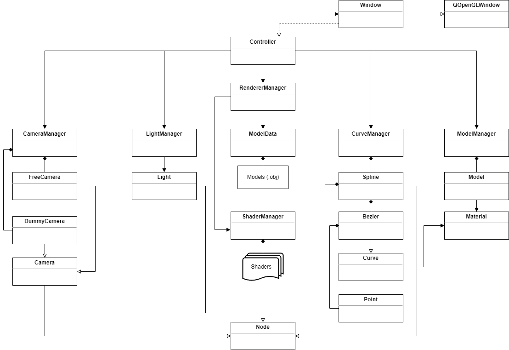

# BSplineCurves3D
Rendering 3D BSplines using OpenGL, Qt, C++ and Eigen.

BSplines are parameterics curves which consists of several Bezier curves whose control points satisfy some special conditions.
I used cubic Bezier curves for the interpolation of knots.
Given a set of knots, a cubic Bezier is generated between each knot. Then these Bezier curves are glued together and forming the final curve, BSpline.
The algorithm for the generation of the curves can be found here. Although it is about 2D BSplines, interpolating 3D BSplines is not so different.
I implemented the algorithm in `createCoefficientMatrix`, `getSplineControlPoints` and `update` methods of `Spline` class.

For the rendering algorithm, this resource helped me a lot. The vertex generation algorithm can be found in `PipeDumb.geom` shader or in `generateVertices` method of `Bezier` class.

# Build
Simply open `BSplineCurves3D.pro` with `QtCreator` and build it with `Qt 5.15.2 MSVC 2019 64-bit` kit.

## Screenshots

## UML Diagram

## Keywords
C++, Qt 5, OpenGL, GLSL, Curves, Bezier Curves, 3D BSplines, Eigen
